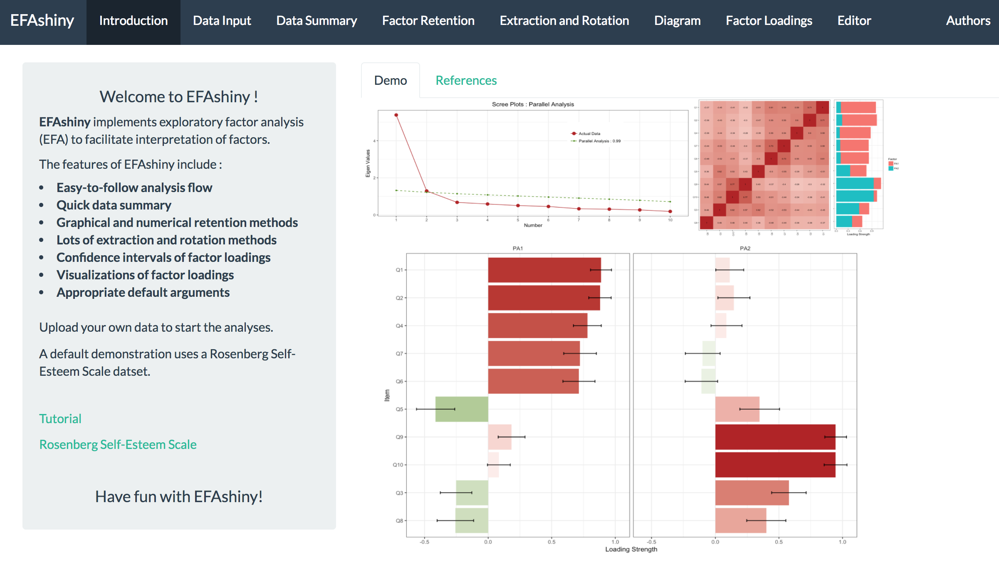
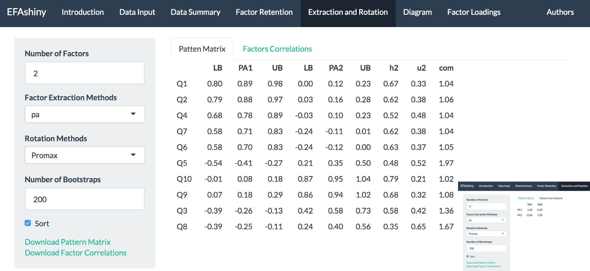
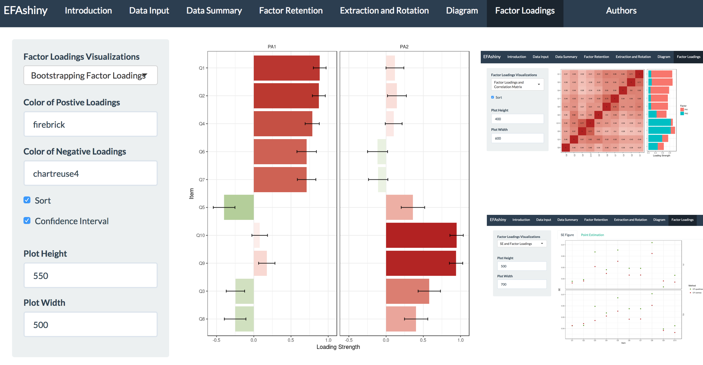

<!-- README.md is generated from README.Rmd. Please edit that file -->

 [](https://opensource.org/licenses/MIT)
[](https://travis-ci.org/PsyChiLin/EFAshiny)
[](https://ci.appveyor.com/project/PsyChiLin/efashiny)
[](https://dependencyci.com/github/PsyChiLin/EFAshiny)

# [EFAshiny](https://psychilin.shinyapps.io/EFAshiny/)

[`EFAshiny`](https://psychilin.shinyapps.io/EFAshiny/) is an
user-friendly application for exploratory factor analysis (EFA;
Bartholomew, Knott, & Moustaki, 2011). The graphical user interface in
shiny (Chang, Cheng, Allaire, Xie, & McPherson, 2017) is designed to
free users from scripting in R by wrapping together various packages for
data management, factor analysis, and graphics. Easy-to-follow analysis
flow and reasonable default settings avoiding common errors (Henson &
Roberts, 2006) are provided. Results of analysis in tables and graphs
are presented on-line and can be exported.

Key features include:

  - Easy-to-follow analysis flow
  - Quick data summary
  - Graphical and numerical retention methods
  - Lots of extraction and rotation methods
  - Confidence intervals of factor loadings
  - Visualizations of factor loadings
  - Default arguments suggested by current research

The intended user of
[`EFAshiny`](https://psychilin.shinyapps.io/EFAshiny/) is a behavioral
science researcher who seeks an easy way to analyze and visualize
item-level scales or datasets with a set of associated variables using
EFA.

## Getting Started

#### 1\. Shiny APP version (recommended)

If you want to use the `EFAshiny`, installation is not required. The
application is deployed on **shinyapps.io** server. <br /> Have fun with
`EFAshiny` : <https://psychilin.shinyapps.io/EFAshiny/>

#### 2\. Github version

To run `EFAshiny` on your R locally,
[`devtools`](https://cran.r-project.org/web/packages/devtools/devtools.pdf)
and [`shiny`](https://cran.r-project.org/web/packages/shiny/shiny.pdf)
are required. <br /> Then, intsall `EFAshiny` from Github.

``` r
#install.packages("devtools")
#install.packages("shiny")
devtools::install_github("PsyChiLin/EFAshiny")
```

To launch the app:

``` r
EFAshiny::EFAshiny()
```

## Tutorial

#### 1\. Exploratory Factor Analysis

`EFAshiny` adopts exploratory factor analysis (EFA, Bartholomew, Knott,
& Moustaki, 2011), a widely used method to investigate the underlying
factor structure that can be used to explain the correlations in a set
of observed indicators, as the major procedure in the application. EFA
can be useful in lots of situations. For example, it can be used to
conceptualize new constructs, to develop instruments, to select items as
a short form scale, or to organize observed variables into meaningful
subgroups. Major procedures of EFA included correlation coefficients
calculation, number of factors determination, factor extraction, and
factor rotation. In addition to the aforementioned steps of EFA, data
explorations should be conducted before using EFA, and interpreting the
results after using EFA is also an important step. Since that EFA is
helpful to account for the relationship between numerous variables, its
use has permeated fields from psychology to business, education and
clinical domain.

#### 2\. Introduction

When you open [`EFAshiny`](https://psychilin.shinyapps.io/EFAshiny/),
the interface will be shown.<br />

  - **Upper Panel**: The upper panel show 7 main tabs for the EFA
    procedure. The order of the tabs from left to right is the suggested
    flow. Users can easily switch the step of the EFA by simply clicking
    the tabs.
  - **Left Panel**: The left panel is used to control the analysis
    setting or change the arguments.
  - **Right Panel**: The right panel displays the results, tables and
    figures.

In the `Introduction` tab, you can see the main features for `EFAshiny`,
a demo figure, and some key references.<br />



#### 3\. Data Input

The data sets that required the implementations of EFA are typically in
a wide format, i.e., one observation per row.<br /> They are composed of
a set of responses in one or more psychometric tests in Likert
scale.<br /> In the `Data Input` tab, users can upload the data.

  - **Upload data-file**: Users can upload their data by browsing their
    computer.
  - **Data Format**: Two kinds of data can be uploaded, including csv
    and txt.
  - **Header of variable**: Users can choose whether their data have
    variable names or not.
  - **Type of Data**: Two data types for EFA are available, including
    the typcial subject by variable raw data and the correlation matrix
    data type.
  - **Variables to include**: User can choose the variables they want to
    include in the further steps. Simply delete the variable name from
    the console.

If no data is uploaded, `EFAshiny` will use the [Rosenberg Self-Esteem
Scale](https://github.com/PsyChiLin/EFAshiny/blob/master/RSE/RSE.csv)
dataset to perform the default demostrations.


#### 4\. Data Summary

After uploading the data, the exploratory data analysis should be
conducted.<br /> In `Data Summary` tab, three types of explorations are
provided.

  - **Numeric Statistic**: The first to fourth order moments for each
    variable were automatically calculated and printed without worrying
    about inputting any arguments.
  - **Distribution**: Histograms that demonstrated numbers of
    observations conditioned on the points of Likert scale (e.g. 1 to 4
    points) reported the distribution of each variable.
  - **Correlation Matrix**: A bird’s eye view of the pairwise
    correlation between variables will be illustrated.
      - **Type of correlation**: Tetrachoric correlations can be adopted
        to calculate the correlations between bivariates, and Polychoric
        correlations can be used on dichotomous ordinal variables. The
        default argument is set to *Pearson’s correlation coefficients*.

Note that the provided correlation matrix is the basis of EFA, which is
a procedure that aim to investigate the underlying structure from the
correlations between variables, so either calculating or visualizing the
correlation matrix will be really important.


#### 5\. Factor Retention

One of the central idea of the EFA is to represent a set of observed
variables by a smaller number of factors. Thus, selecting how many
factors to retain is a critical decision. <br /> In `Factor Retention`
tab, a set of indices to determine numbers of factor are provided.

  - **Scree Plot and Parallel Analysis**: Scree Plot (Cattell, 1966) and
    Parallel Analysis (Horn, 1965) are two popular methods to determine
    numbers of factor.
      - **Quantile of Parallel analysis**: Mean, 95th- and
        99th-percentile eigenvalues of random data can be used as
        criteria.
      - **Number of simulated analyses to perform**: Users can perform
        more simulation to obstain reliable results. In general, the
        default 200 is correct enough.
  - **Numeric Rules**: Velicer’s minimum average partial (MAP, Velicer,
    1976) test, RMSEA, BIC and SRMR are also provided as the objective
    numeric rules.
      - **Max Number of Factor For Estimation**: Users should define
        their max number of factor to estimate. Should be more than
        hypothesized.
  - **Exploratory Graph Analysis (EGA)**: EGA is a new approach, which
    is based on the graphical lasso with the regularization parameter
    specified using EBIC, for retaining factors (Golino & Epskamp,2017).
      - **Number of simulated analyses to perform**: Users can perform
        more simulation to obstain reliable results. Note that too much
        simulated analyses will somehow slow down the EGA.

In addition, **Sample Size** is another option for users to validate the
results for factor retentions by randomly adjusting different Sample
Size.<br /> Although users still have to determine the number of factors
upon their own decisions, `EFAshiny` provides users several indices
without worrying on methods implementations.


#### 6\. Extraction and Rotation

The major step of EFA is to extract and rotate the factors structure,
further estimating the factor loadings.<br /> In `Extraction and
Rotation` tab, several factor extraction and rotation methods are
available, and the boostrapping for estimating confidence intervals of
factor loadings is also provided to aide in interpretations.

  - **Factor Extraction Methods**: Available methods included principal
    axes method (PA), maximum likelihood method (ML), minimum residual
    method (minres), weighted least squares (WLS), generalized weighted
    least squares (GLS), and so on. The default option is PA, which has
    a long history and well performance in psychological studies.
  - **Rotation Methods**: The objective of factor rotation is to obtain
    a simple structure for better interpretation. Both orthogonal
    (e.g. variamx method) and oblique rotations (e.g. promax method)
    are adopted. Using oblique rotations is recommended.
  - **Number of Bootstraps**: By using bootstrapping resampling methods,
    users can obtain interval estimations rather than point estimations.
    Number of bootstrapping to perform can be changed based on users’
    needs.

By providing plenty of factor extraction methods, rotation methods, and
useful interval estimations of factor loadings, `EFAshiny` is not only
helpful for EFA newbies, but also flexible for EFA users with many
experiences.



#### 7\. Diagram

For EFA results, the fundamental visualizations is plotting the
relationship between factors and indicators.<br /> In `Diagram` tab, the
path diagram representation is provided by using `psych` R package
(Revelle, 2017).<br /> It has the structure that all factors and
indicators are represented as a bigger or smaller node, and all loadings
with absolute values greater than some thresholds (e.g. 0.3) are
represented as a line.<br /> Through the graphical representations with
flexible plotting options, users can easily understand the factor
structure.


#### 8\. Factor Loadings

In `Factor Loadings` tab, EFAshiny provides useful visualization of
factor loadings to facilitate proper interpretations of extracted
factors.

  - **Bootstrapping Factor Loadings**: A table of EFA loadings is
    presented graphically. Loadings are represented as a bar and
    conditioned on one or more factors. In order to enhance the
    interpretability at a glance, positive loadings and negative
    loadings are presented by different colors. The greater the loadings
    the deeper the color. Confidence intervals of factor loadings are
    visualizedto provide quick and useful understanding.
  - **Factor Loadings and Correlation Matrix**: The plot includes the
    original correlation matrix of the dataset and a stacked bar-graph
    of the factor loadings is provided for users to make an esay
    comparison.
  - **SE and Factor Loadings**: The plot visualizes the issue, which
    indicates oblique CF-varimax and oblique CF-quartimax rotation
    produced similar point estimates but different standard error
    estimates (Zhang & Preacher, 2015), by presenting comparison figure.
    Users can observe whether the phenomenon exists in their empirical
    dataset.

In addition to providing a table of loadings for EFA results, users can
automatically get the whole picture of the EFA results through these
visualizations.



#### 9\. Summarized Steps

We summarize, in six concrete steps, our provided flow in `EFAshiny` for
performing EFA.

1.  Read the data and review it on the main console. Select which
    variable should be included in further analysis.
2.  Explore the data. For each item, users can examine its numeric
    statistic, distributions, and correlation patterns.
3.  Use multiple criteria to determine the number of factors.
4.  Perform EFA. Input the number of factors that decided in step 3. The
    table of EFA results will be presented, including loadings,
    confidence interval and correlations between factors.
5.  Visualize the results. Three kinds of plots are shown by EFAshiny.
    Get a general idea of the results from these visualization.
6.  Download and use the results, including figures and tables, in every
    step for any purpose.

To see the tutorial in vignettes:

``` r
browseVignettes("EFAshiny")
```

By following this analysis flow in `EFAshiny`, users without any
knowledge of programming are able to perform EFA and obtain great
understandings for their own studies.

## Data

The dataset for demonstration is the 10-items Rosenberg Self-Esteem
Scale (RSE; Rosenberg, 1965) via [an online platform for psychological
research](http://personality-testing.info/_rawdata/). The RSE was
recorded in 1 to 4 Likert scale, where higher scores indicated higher
agreements for the items (1=strongly disagree, 2=disagree, 3=agree, and
4=strongly agree). Previous studies suggested that the RSE could be
treat as a one factor un-dimensional scale, which simply assessed a
positive self-evaluation construct, or a two factor bi-dimensional
scale, where one factor is proposed to assess positive self-esteem
(e.g. I feel that I have a number of good qualities) with another
measuring negative self-esteem (e.g. At times I think I am no good at
all). `EFAshiny` already implements a 256 participants RSE data as a
built-in dataset, but
[RSE.csv](https://github.com/PsyChiLin/EFAshiny/blob/master/RSE/RSE.csv)
with
[codebook](https://github.com/PsyChiLin/EFAshiny/blob/master/RSE/codebook.txt)
can also be directly
    downloaded.

## Dependencies

  - [`bootnet`](https://cran.r-project.org/web/packages/bootnet/bootnet.pdf)
    (Epskamp,
    2017)
  - [`corrplot`](https://cran.r-project.org/web/packages/corrplot/corrplot.pdf)
    (Taiyun & Viliam,
    2017)
  - [`EFAutilities`](https://cran.r-project.org/web/packages/EFAutilities/index.html)
    (See Zhang, 2014 for
    detail)
  - [`reshape2`](https://cran.r-project.org/web/packages/reshape2/reshape2.pdf)
    (Wickham, 2014)
  - [`EGA`](https://github.com/hfgolino/EGA) (Golino & Epskamp,
    2017)
  - [`ggplot2`](https://cran.r-project.org/web/packages/ggplot2/ggplot2.pdf)
    (Wickham,
    2016)
  - [`gridExtra`](https://cran.r-project.org/web/packages/gridExtra/gridExtra.pdf)
    (Auguie,
    2017)
  - [`igraph`](https://cran.r-project.org/web/packages/igraph/igraph.pdf)
    (Csardi & Nepusz,
    2006)
  - [`moments`](https://cran.r-project.org/web/packages/moments/moments.pdf)
    (Komsta & Novomestky, 2013)
  - [`psych`](https://cran.r-project.org/web/packages/psych/psych.pdf)
    (Revelle,
    2017)
  - [`qgraph`](https://cran.r-project.org/web/packages/qgraph/qgraph.pdf)
    (Epskamp, et al., 2012)
  - [`shiny`](https://cran.r-project.org/web/packages/shiny/shiny.pdf)
    (Chang, Cheng, Allaire, Xie, & McPherson,
    2017)
  - [`shinytheme`](https://cran.r-project.org/web/packages/shinythemes/shinythemes.pdf)
    (Chang, 2016)

## References

  - Auguie, B. (2017). gridExtra: Miscellaneous Functions for" Grid"
    Graphics, 2016. R package version, 2.3.
  - Bartholomew, D.J., Knott, M., Irini Moustaki, I. (2011). Latent
    Variable Models and Factor Analysis. A Unified Approach. Wiley.
  - Cattell, R. B. (1966). The scree test for the number of factors.
    Multivar Behav Res, 1(2), 245-276.
  - Chang, W. (2016). shinythemes: Themes for Shiny. R package version
    1.1.1.
  - Chang, W., Cheng, J., Allaire, J. J., Xie, Y., & McPherson, J.
    (2017). shiny: Web application framework for R. R package version
    1.0.0.
  - Csardi, G., & Nepusz, T. (2006). The igraph software package for
    complex network research. InterJournal, Complex Systems, 1695(5),
    1-9.
  - Epskamp, S., Cramer, A. O. J., Waldorp, L.J., Schmittmann, V.D., &
    Borsboom, D. (2012). qgraph: Network Visualizations of Relationships
    in Psychometric Data. Journal of Statistical Software, 48(4), 1-18.
  - Epskamp, S. (2017). bootnet: Bootstrap methods for various network
    estimation routines. R package version 1.0.1
  - Golino, H. F., & Epskamp, S. (2017). Exploratory graph analysis: A
    new approach for estimating the number of dimensions in
    psychological research. PloS one, 12(6), e0174035.
  - Henson, R. K., & Roberts, J. K. (2006). Use of exploratory factor
    analysis in published research: Common errors and some comment on
    improved practice. Educational and Psychological measurement, 66(3),
    393-416.
  - Horn, J. L. (1965). A rationale and test for the number of factors
    in factor analysis. Psychometrika, 30(2), 179-185.
  - Komsta, L., & Novomestky, F. (2013). moments: moments, cumulants,
    skewness, kurtosis and related tests. R package version 0.13.
  - Revelle, W. (2017) psych: Procedures for Personality and
    Psychological Research, Northwestern University, Evanston, Illinois,
    USA, R package version 1.7.8.
  - Rosenberg, M. (1965). Rosenberg self-esteem scale (RSE). Acceptance
    and commitment therapy. Measures package, 61, 52.
  - Taiyun Wei and Viliam Simko (2017). R package “corrplot”:
    Visualization of a Correlation Matrix. R package version 0.84.
  - Velicer, W. F. (1976). Determining the number of components from the
    matrix of partial correlations. Psychometrika, 41(3), 321-327.
  - Wickham, H. (2016). reshape2: Flexibly Reshape Data: A Reboot of the
    Reshape Package. R package version 1.4.2.
  - Wickham, H. (2016). ggplot2: elegant graphics for data analysis.
    Springer.
  - Zhang, G., & Preacher, K. J. (2015). Factor rotation and standard
    errors in exploratory factor analysis. Journal of Educational and
    Behavioral Statistics, 40(6), 579-603.
  - Zhang, G. (2014). Estimating standard errors in exploratory factor
    analysis. Multivariate Behavioral Research, 49, 339-353.

## Authors

[**Chi-Lin Yu**](https://github.com/PsyChiLin) : Department of
Psychology, National Taiwan University, Taiwan<br /> [**Ching-Fan
Sheu**](http://140.116.183.121/~sheu/) : Institute of Education,
National Cheng Kung University, Taiwan<br /> <br /> If you have a
question, comment, concern or code contribution about `EFAshiny`, please
send us an email at <psychilinyu@gmail.com>.
