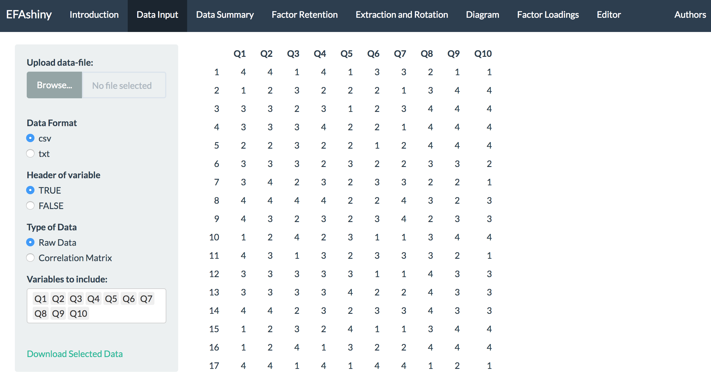
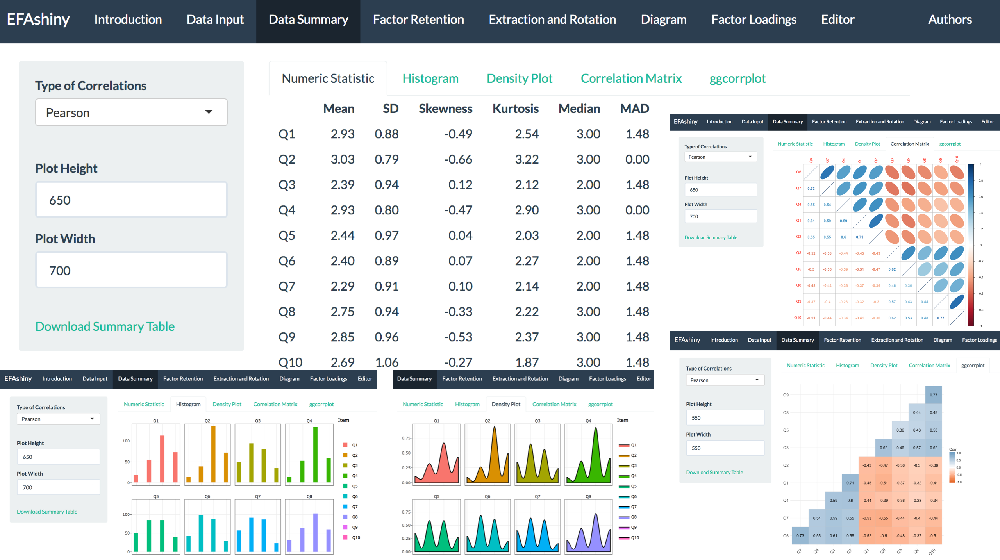

EFAshiny
========

`EFAshiny` is an user-friendly Shiny APP for EFA users who have some experiences with SPSS. <!-- README.md is generated from README.Rmd. Please edit that file -->

Installation
------------

#### 1. Shiny APP version (recommended)

If you want to use the `EFAshiny`, installation is not required. The application is deployed on **shinyapps.io** server. <br /> Have fun with `EFAshiny` : <https://psychilin.shinyapps.io/EFAshiny/>

#### 2. Github version

To run `EFAshiny` on your R locally, you have to intsall `shiny` and `devtools`.

``` r
library(shiny)
library(devtools)
runGitHub("EFAshiny", "PsyChiLin") 
```

Tutorial
--------

#### 0. Exploratory Factor Analysis

`EFAshiny` adopts exploratory factor analysis (EFA), a widely used method to investigate the underlying factor structure that can be used to explain the correlations in a set of observed indicators, as the major procedure in the application. EFA can be useful in lots of situations. For example, it can be used to conceptualize new constructs, to develop instruments, to select items as a short form scale, or to organize observed variables into meaningful subgroups. Major procedures of EFA included correlation coefficients calculation, number of factors determination, factor extraction, and factor rotation. In addition to the aforementioned steps of EFA, data explorations should be conducted before using EFA, and interpreting the results after using EFA is also an important step. Since that EFA is helpful to account for the relationship between numerous variables, its use has permeated fields from psychology to business, education and clinical domain.

#### 1. Introduction

When you open `EFAshiny`, the interface will be shown.<br />

-   **Upper Panel**: The upper panel show 7 main tabs for the EFA procedure. The order of the tabs from left to right is the suggested flow. Users can easily switch the step of the EFA by simply clicking the tabs.
-   **Left Panel**: The left panel is used to control the analysis setting or change the arguments.
-   **Right Panel**: The right panel displays the results, tables and figures.

In the `Introduction` tab, you can see the main features for `EFAshiny`, a demo figure, and some key references.<br />


#### 2. Data Input

In the `Data Input` tab, users can upload the data.<br />

-   **Upload data-file**: Users can upload their data by browsing their computer.
-   **Data Format**: Two kinds of data can be uploaded, including csv and txt.
-   **Header of variable**: Users can choose whether their data have variable names or not.
-   **Type of Data**: Two data types for EFA are available, including the typcial subject by variable raw data and the correlation matrix data type.
-   **Variables to include**: User can choose the variables they want to include in the further steps. Simply delete the variable name from the console.

If no data is uploaded, `EFAshiny` will use the [Rosenberg Self-Esteem Scale](%22https://www.dropbox.com/s/hpksg1zev5021z1/RSE.zip?dl=0%22) dataset to perform the default demostrations.



#### 3. Data Summary

After uploading the data, the exploratory data analysis should be conducted.<br /> In `Data Summary` tab, three types of explorations are provided.

-   **Numeric Statistic**: The first to fourth order moments for each variable were automatically calculated and printed without worrying about inputting any arguments.
-   **Distribution**: Histograms that demonstrated numbers of observations conditioned on the points of Likert scale (e.g. 1 to 4 points) reported the distribution of each variable.
-   **Correlation Matrix**: A bird’s eye view of the pairwise correlation between variables will be illustrated.
    -   **Type of correlation**: Tetrachoric correlations can be adopted to calculate the correlations between bivariates, and Polychoric correlations can be used on dichotomous ordinal variables. The default argument is set to *Pearson’s correlation coefficients*.

Note that the provided correlation matrix is the basis of EFA, which is a procedure that aim to investigate the underlying structure from the correlations between variables, so either calculating or visualizing the correlation matrix will be really important.



#### 3. Factor Retention

One of the central idea of the EFA is to represent a set of observed variables by a smaller number of factors. Thus, selecting how many factors to retain is a critical decision. <br /> In `Factor Retention` tab, a set of indices to determine numbers of factor are provided.

-   **Scree Plot and Parallel Analysis**: Scree Plot (Cattell, 1966) and Parallel Analysis (Horn, 1965) are two popular methods to determine numbers of factor.
    -   **Quantile of Parallel analysis**: Mean, 95th- and 99th-percentile eigenvalues of random data can be used as criteria.
    -   **Number of simulated analyses to perform**: Users can perform more simulation to obstain reliable results. In general, the default 200 is correct enough.
-   **Numeric Rules**: Velicer's minimum average partial (MAP, Velicer, 1976) test, RMSEA, BIC and SRMR are also provided as the objective numeric rules.
    -   **Max Number of Factor For Estimation**: Users should define their max number of factor to estimate. Should be more than hypothesized.
-   **Exploratory Graph Analysis (EGA)**: EGA is a new approach, which is based on the graphical lasso with the regularization parameter specified using EBIC, for retaining factors (Golino & Epskamp, 2017).
    -   **Number of simulated analyses to perform**: Users can perform more simulation to obstain reliable results. Note that too much simulated analyses will somehow slow down the EGA.

In addition, **Sample Size** is another option for users to validate the results for factor retentions by randomly adjusting different Sample Size.<br /> Although users still have to determine the number of factors upon their own decisions, `EFAshiny` provides users several indices without worrying on methods implementations.


#### 4.

#### 5.

#### 6.

Data
----

References
----------

Cattell, R. B. (1966). The scree test for the number of factors. Multivar Behav Res, 1(2), 245-276. Golino, H. F., & Epskamp, S. (2017). Exploratory graph analysis: A new approach for estimating the number of dimensions in psychological research. PloS one, 12(6), e0174035. Horn, J. L. (1965). A rationale and test for the number of factors in factor analysis. Psychometrika, 30(2), 179-185. Velicer, W. F. (1976). Determining the number of components from the matrix of partial correlations. Psychometrika, 41(3), 321-327.

Authors
-------
